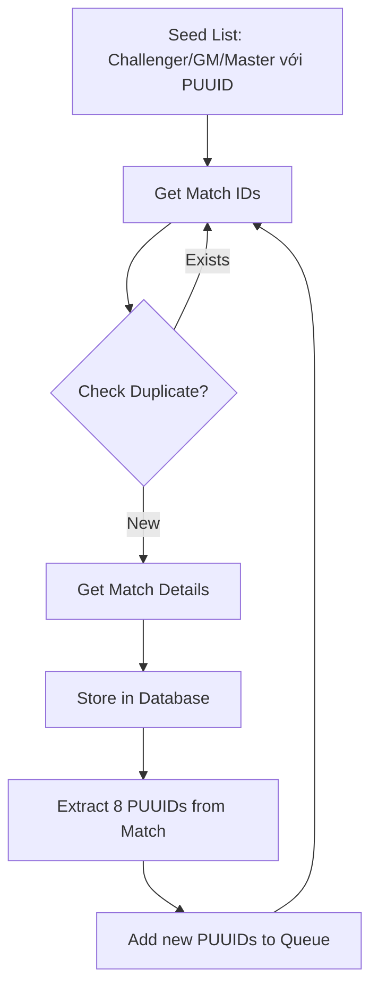

# TFT Data Collector - Implementation Strategy

## 📋 Tổng Quan Hệ Thống

Hệ thống gồm **4 Subsystems** chính:

### 1. 📊 View Stats
- **Hiển thị**: Top Comps, Items, Units, Traits
- **Yêu cầu**: Thu thập Match Data để thống kê

### 2. 🔍 Search Players
- **Thu thập**: PlayerName#TagLine và PUUID
- **Cơ chế**: Frontend POST → Backend → Riot API (realtime, không lưu trữ)

### 3. 📝 Add Posts
- Không sử dụng Riot API

### 4. 🛠️ Team Builder
- Không sử dụng Riot API

---

## 🎯 Dữ Liệu Cần Thu Thập

Repository này tập trung vào **2 loại dữ liệu** chính:

- ✅ **Player Information**: PlayerName#TagLine + PUUID
- ✅ **Match Information**: Chi tiết trận đấu (cập nhật sau)

---

## 🔄 Chiến Lược: Snowball Crawling

> **Phương pháp thu thập dữ liệu mở rộng dần từ một điểm khởi đầu nhỏ.**

### Bước 1: Khởi tạo Seed List (Danh sách hạt giống)

**📌 Mục tiêu**: Lấy danh sách người chơi rank cao làm điểm xuất phát

**📍 API Endpoints**:
```
GET /tft/league/v1/challenger
GET /tft/league/v1/grandmaster
GET /tft/league/v1/master
```

**📤 Output**: Danh sách người chơi với **PUUID** có sẵn

> � **Lưu ý**: API League đã trả về PUUID trực tiếp, không cần gọi thêm API Summoner!

---

### Bước 2: Thu thập Match IDs

**📌 Mục tiêu**: Lấy danh sách trận đấu gần đây của mỗi người chơi

**📍 API Endpoint**:
```
GET /tft/match/v1/matches/by-puuid/{puuid}/ids
```

**⚙️ Parameters**: 
- `count=20` (hoặc nhiều hơn)

**📤 Output**: Danh sách Match IDs (ví dụ: 20 trận gần nhất)

---

### Bước 3: Lọc trùng lặp Match IDs ⭐ **QUAN TRỌNG**

**📌 Vấn đề**: 
- Nhiều người chơi rank cao thường chơi cùng nhau
- → Cùng 1 Match ID sẽ xuất hiện **hàng chục lần**

**📌 Giải pháp**:
- ✅ Sử dụng `Set` trong memory để kiểm tra trùng lặp
- ✅ Hoặc sử dụng Database với Match ID là **Primary Key**
- ✅ Bỏ qua Match ID đã tồn tại

> ⚠️ **Lưu ý**: Bước này tiết kiệm **hàng ngàn API calls** không cần thiết!

---

### Bước 4: Lấy chi tiết Match Data 🏆

**📌 Mục tiêu**: Thu thập toàn bộ thông tin chi tiết của trận đấu

**📍 API Endpoint**:
```
GET /tft/match/v1/matches/{matchId}
```

**📤 Output**: 

Một JSON object lớn chứa thông tin của **cả 8 người chơi**:
- Champions (Tướng)
- Items (Trang bị)
- Traits (Lõi công nghệ)
- Placement (Vị trí)
- PUUID của tất cả người chơi
- Và nhiều thông tin khác...

**💾 Lưu trữ**: Toàn bộ JSON vào Database

---

### Bước 5: Snowball Effect - Mở rộng danh sách 📈

**📌 Cơ chế**:

1. Mỗi trận đấu có **8 người chơi** → **8 PUUIDs**
2. **7/8 người chơi** có thể CHƯA có trong danh sách của bạn
3. Thêm các PUUID mới vào hàng đợi (queue)
4. Quay lại **BƯỚC 2** với các PUUID mới

**📌 Kết quả**:
- 🌱 **Bắt đầu**: Vài nghìn người chơi rank cao
- 🌿 **Sau vài vòng**: Hàng chục nghìn người chơi mọi rank
- 🌳 **Tiếp tục**: Mở rộng theo cấp số nhân

---

## 📊 Luồng Dữ Liệu Tổng Quát



**Hoặc mô tả dạng text:**

```
Seed List (Challenger/GM/Master) → Đã có PUUID sẵn
        ↓
    Get Match IDs → Check Duplicate → Skip if exists
        ↓
    Get Match Details → Store in Database
        ↓
    Extract 8 PUUIDs from Match
        ↓
    Add new PUUIDs to Queue
        ↓
    [Repeat from "Get Match IDs"]
```

---

## 🎯 Kết Luận

Chiến lược **Snowball Crawling** cho phép:

| Lợi ích | Mô tả |
|---------|-------|
| 🚀 **Khởi đầu dễ dàng** | Bắt đầu với dataset nhỏ (người chơi rank cao) |
| 🔗 **Tự động mở rộng** | Mở rộng qua network effect |
| 🎲 **Dữ liệu đa dạng** | Thu thập từ nhiều rank khác nhau |
| ⚡ **Tối ưu hiệu suất** | Giảm API calls qua deduplication |

---

## 📚 Tài Liệu Tham Khảo

- [Riot Games API Documentation](https://developer.riotgames.com/apis)
- [TFT League API](https://developer.riotgames.com/apis#tft-league-v1)
- [TFT Match API](https://developer.riotgames.com/apis#tft-match-v1)
- [TFT Summoner API](https://developer.riotgames.com/apis#tft-summoner-v1)

---

**Last Updated**: October 31, 2025  
**Version**: 1.0
